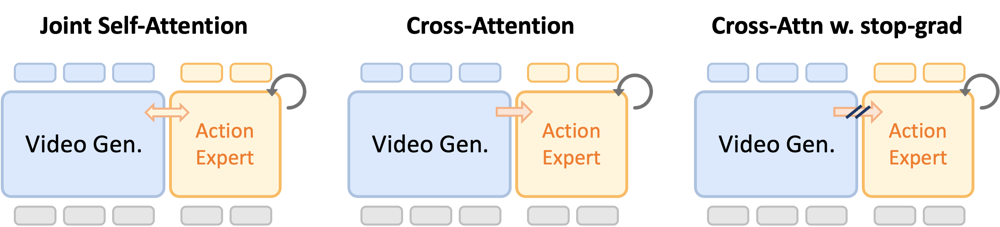
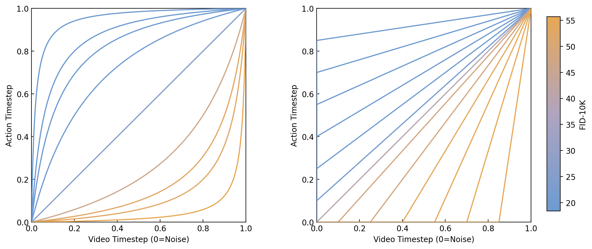

# Nano-WAM

**Nano World-Action Model** — A Modular Open-Source Library for Systematic WAM Training, Inference and Deployment


## Project Structure

```
nano-WAM/
├── diffsynth/                          # Core diffusion framework
│   ├── models/
│   │   └── action_dit.py              # ActionDiT: lightweight action generation stream
│   ├── core/                          # Attention, data loading, VRAM management
│   ├── configs/                       # Model configurations
│   ├── diffusion/                     # Diffusion schedulers & losses
│   ├── pipelines/                     # Inference pipelines
│   └── utils/                         # Utilities
├── examples/wanvideo/wam/     # Training & evaluation scripts
│   ├── train_video_action.py          # Joint training module
│   ├── video_action_dataset.py        # RoboTwin dataset loaders
│   ├── joint_inference.py             # Joint denoising loop & schedule generators
│   ├── eval_robotwin.py               # Offline/online evaluation
│   └── compute_action_stats.py        # Action normalization stats
├── data/robotwin/                     # Precomputed action statistics
├── assets/                            # Architecture diagrams
└── pyproject.toml
```

## Quick Start

### Installation

```bash
cd nano-WAM
pip install -e .
```

### Training



```bash
accelerate launch examples/wanvideo/wam/train_video_action.py \
  --dataset_type robotwin_multitask \
  --dataset_dir /path/to/robotwin_2_0/dataset \
  --robot arx-x5 --variant clean_50 \
  --backbone vace \
  --trainable_models vace \
  --extra_inputs "vace_video,vace_reference_image,action_trajectory" \
  --bridge_type cross_attn_detach \
  --lambda_video 1.0 --lambda_action 1.0
```

### Key Training Flags

| Flag | Description |
|------|-------------|
| `--backbone vace\|ti2v` | Video backbone selection |
| `--bridge_type` | `cross_attn`, `cross_attn_detach` (default), `joint_self_attn` |
| `--lambda_video` / `--lambda_action` | Loss weights (set `--lambda_action 0` for video-only) |
| `--multiview` | Assemble head/left/right cameras into 2x2 grid |
| `--dataset_type` | `robotwin` (single-task) or `robotwin_multitask` |

### Inference



```python
from joint_inference import make_schedule, generate_video_and_actions

# Synchronized denoising
schedule = make_schedule("sync", num_steps=20)

# Action-only (video clean, action denoises)
schedule = make_schedule("action_only", num_steps=20)

# Video leads action by N steps
schedule = make_schedule("video_leading", num_steps=20, lead_steps=10)

# Cascade: video first, then action
schedule = make_schedule("cascade", video_steps=20, action_steps=20)
```

### Evaluation

```bash
python examples/wanvideo/wam/eval_robotwin.py \
  --action_checkpoint /path/to/checkpoint.safetensors \
  --task_name adjust_bottle --robot arx-x5 \
  --hdf5_data_root /path/to/dataset \
  --offline --num_eval_samples 5
```

## Supported Backbones

| Backbone | Model | Conditioning | Hidden Dim | Resolution |
|----------|-------|-------------|------------|------------|
| `vace` | Wan2.1-VACE-1.3B | Frozen DiT + Context Blocks | 1536 | 480x832, 720x1280 |
| `ti2v` | Wan2.2-TI2V-5B | Per-token timestep | 3072 | Any (h%32==0, w%32==0) |

## Dataset

**RoboTwin 2.0** — 50 bimanual manipulation tasks across 5 robot embodiments: `aloha-agilex`, `arx-x5`, `franka`, `ur5`, `airbot`.

- training tasks plus held-out tasks for zero-shot transfer evaluation
- Each HDF5 episode contains JPEG-encoded camera frames and `joint_action/vector` (T, 14) actions


## Acknowledgements

Built upon [DiffSynth-Studio](https://github.com/modelscope/DiffSynth-Studio) and inspired by [StarVLA](https://github.com/starVLA/starVLA).

## Citation & Copyright

Nano-WAM is released under the MIT License, which permits commercial use, modification, distribution, and private use. Rebases are allowed for forks and feature branches; when rebasing from upstream StarVLA, use descriptive commit messages (e.g., "chore: rebase from StarVLA") and keep at least the two latest upstream commits as separate. See [License](LICENSE) for details.

```
@misc{starvla2025,
  title        = {NanoWAM: A Modular Open-Source Library for Systematic WAM Training, Inference and Deployment},
  author       = {NanoWAM Contributors},
  year         = {2026},
  month        = {tbd},
  version      = {1.0.0},
  url          = {https://github.com/starVLA/starVLA},
  doi          = {10.5281/zenodo.18264214},
  howpublished = {GitHub repository},
  publisher    = {GitHub},
  keywords     = {vision-language-action, robot-learning, modular-framework}
}
```