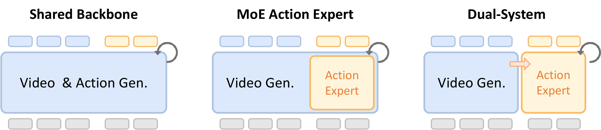

# OpenWAM

OpenWAM is an open-source framework for **World-Action Models (WAMs)**: video-diffusion policies that jointly model future visual dynamics and robot actions.

The repository is organized around the `open_wam/` package and currently supports:

- Hydra-based training, inference, and evaluation entrypoints
- WAM-specific action/video scheduling and receding-horizon execution
- multi-dataset training utilities and embodiment-aware action conversion
- benchmark adapters for RoboTwin, SimplerEnv, and LIBERO
- a policy server for robot deployment workflows



## What OpenWAM Focuses On

OpenWAM is not a VLA clone. Its core direction is to use a video world model as the control backbone.

- Backbone: Wan-family video diffusion models
- Action modeling: flow-matched action generation coupled to video denoising
- Strengths: temporal coherence, world-model-style rollout, flexible denoising schedules
- Primary use cases: joint video-action generation, action-only rollout, embodied evaluation, robot serving

## Repository Layout

The main path is package-first.

```text
OpenWAM/
├── open_wam/
│   ├── data/          # Dataset adapters, action stats, embodiment abstraction
│   ├── models/        # WAM architectures and conditioning modules
│   ├── training/      # Trainer abstractions and loss modules
│   ├── inference/     # Joint inference engine and schedule utilities
│   ├── evaluation/    # Policies, evaluators, benchmark adapters
│   └── serving/       # Policy server for deployment
├── scripts/           # Hydra entrypoints: train / infer / eval
├── configs/           # Hydra configs for model, data, training, eval, deploy
├── tests/             # Unit tests for core OpenWAM functionality
├── assets/            # Architecture and scheduling diagrams
└── third_party/       # Vendored dependencies required by current main path
```

Notes on legacy code:

- `examples/wanvideo/wam/` still exists and parts of the current training/inference stack depend on it internally.
- The recommended user-facing entrypoints are `scripts/train.py`, `scripts/infer.py`, and `scripts/eval.py`.
- Full package-native decoupling from legacy WanVideo scripts is planned and tracked in `plan.md`.

## Support Status

### Architectures

| Component | Status | Notes |
|---|---|---|
| `dual_system` | Supported | Main architecture path for current training/inference stack |
| `moe_expert` | Supported | Implemented and covered by unit tests |
| `shared_backbone` | Experimental | Registry keeps it visible, but the default builder blocks it from the supported path until implementation lands |

### Benchmarks and Deployment

| Capability | Status | Notes |
|---|---|---|
| RoboTwin offline eval | Supported | Primary documented evaluation path |
| RoboTwin online eval | Supported | Environment-dependent |
| SimplerEnv eval | Supported in code | Requires external environment setup |
| LIBERO eval | Supported in code | Requires external environment setup |
| Policy server | Supported in code | Phase 2 will further productize deployment workflow |

## Installation

### Base installation

```bash
pip install -e .
```

### Optional serving dependencies

The policy server can be installed via the optional `serving` extra:

```bash
pip install -e ".[serving]"
```

## Quick Start

### 1. Training

Default training uses Hydra config composition from `configs/`.

```bash
python scripts/train.py \
  data.dataset_dir=/path/to/robotwin_2_0/dataset
```

Useful overrides:

```bash
python scripts/train.py \
  training=joint \
  model/backbone=vace_1_3b \
  data=robotwin_multitask \
  data.dataset_dir=/path/to/robotwin_2_0/dataset \
  data.robot=arx-x5 \
  data.variant=clean_50
```

Other common training presets:

- `training=video_only`
- `training=action_finetune`
- `training=decoupled`
- `model/backbone=ti2v_5b`
- `data=robotwin`
- `data=mixture`

Current caveat:

- The training entrypoint is the recommended interface, but it still delegates part of the implementation to legacy WanVideo training code internally.

### 2. Inference

```bash
python scripts/infer.py \
  inference=sync \
  inference.prompt="robot picks up the bottle" \
  inference.seed=42
```

Available inference schedules in `configs/inference/`:

- `sync`
- `action_only`
- `video_leading`
- `cascade`

Programmatic schedule utilities are available in `open_wam.inference.schedule`.

### 3. Evaluation

Offline RoboTwin evaluation:

```bash
python scripts/eval.py \
  eval=robotwin_offline \
  eval.ckpt_path=/path/to/checkpoint.safetensors
```

Online RoboTwin evaluation:

```bash
python scripts/eval.py \
  eval=robotwin_online \
  eval.ckpt_path=/path/to/checkpoint.safetensors
```

Additional benchmark configs already in the repo:

- `eval=simpler_env`
- `eval=libero`

These benchmarks require their own simulator/environment dependencies.

See `docs/benchmarks/README.md` for the benchmark support matrix, expected dependencies, and example commands for RoboTwin, SimplerEnv, and LIBERO.

### 4. Deployment

The deployment module lives in `open_wam.serving.policy_server` and the default deployment config is `configs/deploy/server.yaml`.

Recommended startup path:

```bash
openwam-serve \
  --ckpt-path /path/to/checkpoint.safetensors \
  --config configs/config.yaml \
  --host 0.0.0.0 \
  --ws-port 8765 \
  --http-port 8766
```

Equivalent module invocation:

```bash
python -m open_wam.serving.policy_server \
  --ckpt-path /path/to/checkpoint.safetensors
```

Server endpoints:

- WebSocket: `ws://HOST:WS_PORT`
- HTTP `POST /predict`
- HTTP `POST /reset`
- HTTP `GET /health`
- HTTP `GET /info`

Minimal HTTP client example:

```bash
python scripts/policy_client.py \
  --server http://127.0.0.1:8766 \
  --image /path/to/frame.jpg \
  --prompt "pick up the bottle"
```

## Config System

OpenWAM uses Hydra composition rooted at `configs/config.yaml`.

Default stack:

- model: `action_dit_small`
- backbone: `vace_1_3b`
- data: `robotwin_multitask`
- training: `joint`
- inference: `sync`
- eval: `robotwin_offline`

Important config groups:

- `configs/model/`
- `configs/data/`
- `configs/training/`
- `configs/inference/`
- `configs/eval/`
- `configs/deploy/`

Run traceability:

- training startup now writes run artifacts under `OUTPUT_PATH/run_artifacts/<RUN_ID>/`
- saved files include:
  - `resolved_config.yaml`
  - `resolved_config.json`
  - `flat_args.json`
  - `run_metadata.json`

These snapshots are intended to make checkpoints easier to reproduce even while the main training path still wraps legacy internals.

## Core Features

- Joint video-action denoising with configurable schedules
- receding-horizon execution with temporal ensembling
- shared package-native model-loading path for inference, evaluation, and serving
- `MixtureDataset` for multi-dataset co-training
- embodiment-aware action conversion for cross-robot use
- proprioceptive conditioning module for robot state input
- benchmark adapters for RoboTwin, SimplerEnv, and LIBERO
- WebSocket + HTTP policy server for deployment workflows

## Tests

Run the core test suite with:

```bash
pytest -q tests
```

This validates the `open_wam/` package without pulling in example/dev-only tests.

Standard repo validation commands:

```bash
make test
make check
```

`make check` runs a syntax-level compile pass plus the core test suite. CI uses the same entrypoint.

## Roadmap

The active maturity roadmap is tracked in `plan.md`.

Current phase:

- Phase 1 - Repo Narrative and Main-Path Alignment

## Acknowledgements

OpenWAM builds on ideas and components from:

- [DiffSynth-Studio](https://github.com/modelscope/DiffSynth-Studio)
- [StarVLA](https://github.com/starVLA/starVLA)

## License

OpenWAM is released under the MIT License. See `LICENSE`.

## Citation

If you use OpenWAM, please cite the repository directly:

```bibtex
@misc{openwam2026,
  title        = {OpenWAM: A Modular Open-Source Library for Systematic WAM Training, Inference and Deployment},
  author       = {OpenWAM Contributors},
  year         = {2026},
  url          = {https://github.com/KraHsu/OpenWAM},
  howpublished = {GitHub repository}
}
```
